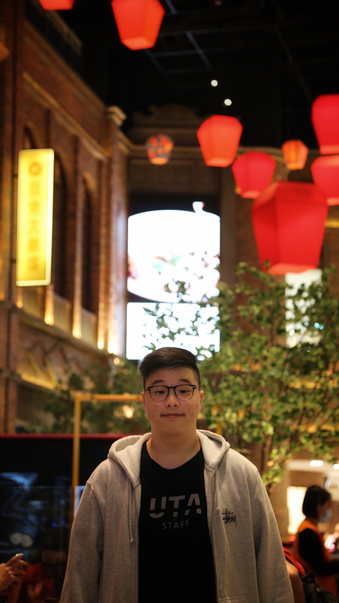

# Introduction

{:height='400px' width='200px'}
Hello, my name is Lucas and I'm currently a senior at UCSD studying **Data Science**.
One of my favorite quotes is from my high school computer science teacher who always emphasized:
> Think, write, then code

Since I tend to work on multiple projects at a time, I find myself switching environments with anaconda pretty often with 
```
conda activate
conda deactivate
```


I am also part of the course staff of [DSC80](http://dsc80.com) this quarter as a tutor. Although this is my first quarter tutoring 80, I've tutored the following courses before
- DSC30
- DSC40B

For the readme of this repo, please visit [here](./README.md)

Things to do this quarter
- [x] Find classes to take
- [ ] Eat at Underbelly on campus
- [ ] 3 recommendation letters


## I also like to eat ramen


[Back to top](#introduction)


