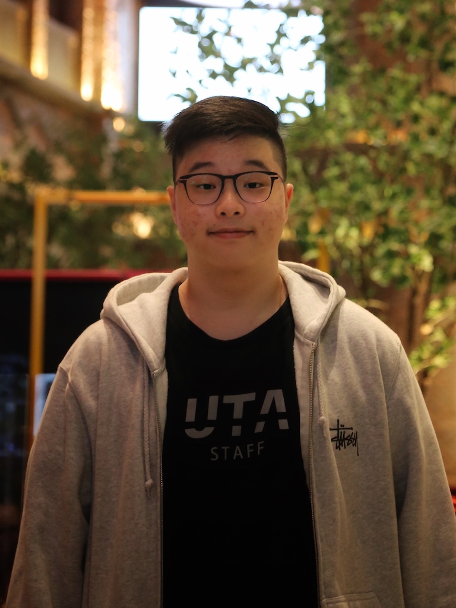

# Introduction



Hello, my name is Lucas and I'm currently a senior at UCSD studying **Data Science**.
One of my favorite quotes is from my high school computer science teacher who always emphasized:
> Think, write, then code

### This Quarter
Since I am taking a couple project oriented classes this quarter, I find myself switching environments with anaconda pretty often with 
```
conda activate
conda deactivate
```


I am also part of the course staff of [DSC80](http://dsc80.com) this quarter as a tutor. Although this is my first quarter tutoring 80, I've tutored the following courses before
- DSC30
- DSC40B


For the readme of this repo, please visit [here](./README.md)


Since this is my final year here at UCSD, some things that I want to do before graduation is:
- [ ] Try every single restaurant on campus once 
- [ ] Find my favoriate restaurant in SD
- [ ] Go on a senior trip


[Back to top](#introduction)

### I also like to eat ramen


